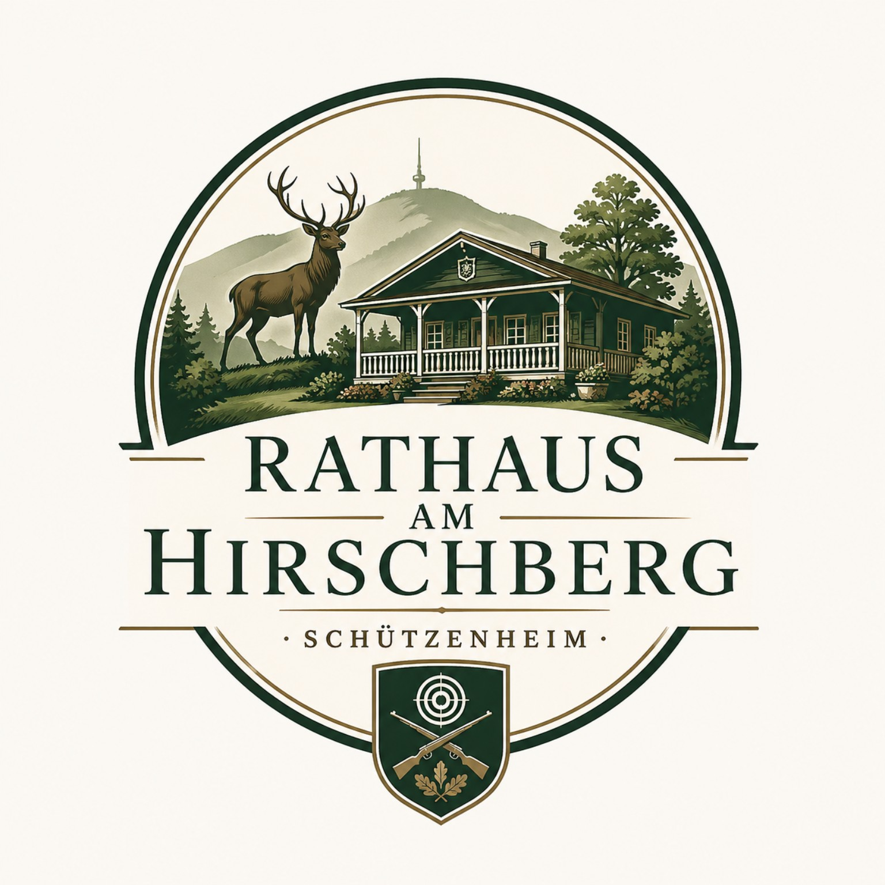
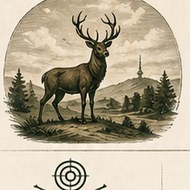
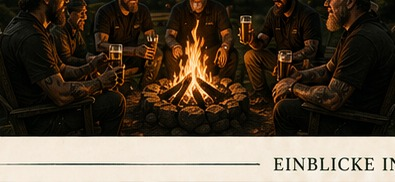
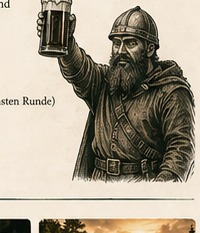
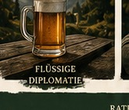
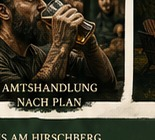
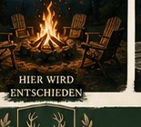
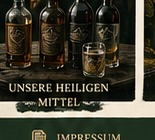
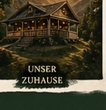

<!DOCTYPE html>
<html lang="de">
<head>
  <meta charset="UTF-8" />
  <meta name="viewport" content="width=device-width, initial-scale=1.0" />
  <title>Rathaus am Hirschberg – Schützenheim</title>
  <meta name="description" content="Rathaus am Hirschberg – Schützenheim. Kein richtiges Rathaus, aber mit den wichtigsten Gesetzen." />
  <link rel="stylesheet" href="style.css" />
</head>

<body>
  <header class="site-header">
    <a class="brand" href="#start" aria-label="Rathaus am Hirschberg Startseite">
      
      
        <strong>Rathaus am Hirschberg</strong>
        <small>Schützenheim</small>
      
    </a>

    <input type="checkbox" id="nav-toggle" class="nav-toggle" aria-label="Menü öffnen">
    <label for="nav-toggle" class="nav-button">☰ Menü</label>

    <nav class="main-nav">
      <a href="#ueber-uns">Über uns</a>
      <a href="#gesetze">Gesetze</a>
      <a href="#ratssitzungen">Ratssitzungen</a>
      <a href="#getraenkekammer">Getränkekammer</a>
      <a href="#galerie">Galerie</a>
      <a href="#impressum">Impressum</a>
    </nav>
  </header>

  <main id="start">
    <section class="hero">
      

      

        
Willkommen im

        <h1>Rathaus am Hirschberg</h1>
        
Schützenheim

        
Kein richtiges Rathaus. Aber mit den wichtigsten Gesetzen.

        

          <a class="button" href="#gesetze">Gesetze ansehen</a>
          <a class="button secondary" href="#ratssitzungen">Ratssitzung einberufen</a>
        

      

    </section>

    <section id="ueber-uns" class="paper-section">
      
☙

      

        
        

          <h2>Über uns</h2>
          

            Ein Ort der Gemeinschaft, des Humors und der guten Getränke.
            Bei uns regieren Freundschaft, Respekt und der gesunde Menschenverstand.
          

          

            Das Rathaus am Hirschberg ist eigentlich ein Garten-Grundstück mit schöner Hütte,
            Veranda und bester Aussicht – trägt seinen Namen aber mit voller Amtswürde.
          

        

        
      

      

        <article class="feature">
          
🎯

          <h3>Gesetze</h3>
          
Unsere Gesetze sind nicht im Amtsblatt zu finden – aber sie sorgen für Ordnung und flüssige Besprechungen.

          <a href="#gesetze">Gesetze ansehen</a>
        </article>

        <article class="feature">
          
🔥

          <h3>Ratssitzungen</h3>
          
Regelmäßig am Lagerfeuer. Tagesordnung: Bier kalt halten und Probleme warm lösen.

          <a href="#ratssitzungen">Ratssitzungen ansehen</a>
        </article>

        <article class="feature">
          
🍺

          <h3>Getränkekammer</h3>
          
Eine Übersicht unserer wichtigsten Grundnahrungsmittel und Gesetzesgrundlagen.

          <a href="#getraenkekammer">Zur Getränkekammer</a>
        </article>

        <article class="feature">
          
☠️

          <h3>Seit 2024</h3>
          
Gegründet aus einer Idee, einem Plan und einer Kiste Bier.

          <a href="#impressum">Mehr erfahren</a>
        </article>
      

    </section>

    <section id="gesetze" class="law-section">
      

        <h2>Gesetze des Rathaus am Hirschberg</h2>
        
Nicht im Bundesgesetzblatt, aber dafür im Herzen verankert.

        

          

            <article class="law-item">
              
🍺

              
<strong>§1 Bier ist Grundnahrung</strong>
Bier schützt vor Durst, schlechter Laune und trockenen Kehlen.

            </article>
            <article class="law-item">
              
🥃

              
<strong>§2 Williams Christ – heiliges Wasser</strong>
Ein Williams belebt die Geister und fördert gute Ideen.

            </article>
            <article class="law-item">
              
🍐

              
<strong>§3 Obstler – für alle Fälle</strong>
Obstler hilft immer: bei Kälte, bei Wärme, bei Freude und bei Leid.

            </article>
            <article class="law-item">
              
🍷

              
<strong>§4 Trollinger – der rote Freund</strong>
Trollinger stärkt die Gemeinschaft und den Gesprächsfluss.

            </article>
          

          

            <article class="law-item">
              
🍷

              
<strong>§5 Lemberger – für stabile Entscheidungen</strong>
Lemberger sorgt für Standhaftigkeit bei allen Abstimmungen.

            </article>
            <article class="law-item">
              
🌹

              
<strong>§6 Rosé – die farbige Verständigung</strong>
Rosé ist die diplomatische Lösung in allen Fragen.

            </article>
            <article class="law-item">
              
🥂

              
<strong>§7 Weißherbst – klare Sache</strong>
Weiß- oder Weißherbst bringt Klarheit in trübe Angelegenheiten.

            </article>
            <article class="law-item">
              
🕙

              
<strong>§8 Nach 22 Uhr gelten Sondergesetze</strong>
Ab 22 Uhr entscheidet nicht mehr der Kopf, sondern das Herz – und manchmal der Wirt.

            </article>
          

        

      

    </section>

    <section id="ratssitzungen" class="paper-section meetings">
      

        
        

          <h2>Ratssitzungen am Lagerfeuer</h2>
          
Unsere Ratssitzungen finden regelmäßig und situationsabhängig am Lagerfeuer statt.

          <ul>
            <li>Tagesordnung wird vor Ort beschlossen</li>
            <li>Alle Bürger haben Rederecht</li>
            <li>Entscheidungen sind bindend bis zur nächsten Runde</li>
            <li>Protokoll wird meist nicht geschrieben</li>
          </ul>
        

        
      

    </section>

    <section id="getraenkekammer" class="drink-section">
      

        <h2>Getränkekammer</h2>
        
Amtliche Übersicht der wichtigsten Grundversorgungsmittel.

        

          <article>🍺<h3>Bier</h3>
Grundversorgung bei Ankunft, Sitzung und Feierabend.
</article>
          <article>🥃<h3>Williams Christ</h3>
Für geistige Erhellung nach erfolgreicher Beschlussfassung.
</article>
          <article>🍐<h3>Obstler</h3>
Universalmittel für nahezu jede Wetterlage.
</article>
          <article>🍷<h3>Trollinger</h3>
Gemeinschaftspflege und Gesprächsfluss.
</article>
          <article>🍷<h3>Lemberger</h3>
Standhaftigkeit bei schwierigen Entscheidungen.
</article>
          <article>🌹<h3>Rosé</h3>
Diplomatie, wenn keiner streiten will.
</article>
          <article>🥂<h3>Weißherbst</h3>
Klarstellung bei unklarer Lage.
</article>
        

      

    </section>

    <section id="galerie" class="paper-section gallery-section">
      

        <h2>Einblicke in unser Revier</h2>
        

          <figure><figcaption>Flüssige Diplomatie</figcaption></figure>
          <figure><figcaption>Amtshandlung nach Plan</figcaption></figure>
          <figure><figcaption>Hier wird entschieden</figcaption></figure>
          <figure><figcaption>Unsere heiligen Mittel</figcaption></figure>
          <figure><figcaption>Unser Zuhause</figcaption></figure>
        

      

    </section>

    <section id="impressum" class="impressum">
      

        <h2>Impressum</h2>
        
<strong>Angaben gemäß § 5 TMG</strong>

        

          Matthias Schädel 
          Hirschberg 1 
          74182 Obersulm 
          Deutschland
        

        

          E-Mail:
          <a href="mailto:matthias.schaedel@gmail.com">matthias.schaedel@gmail.com</a>
        

        

          Hinweis: Diese Webseite ist ein privates Spaßprojekt. Das „Rathaus am Hirschberg“ ist kein offizielles Rathaus und keine öffentliche Behörde.
        

        <a class="to-top" href="#start">Nach oben ↑</a>
      

    </section>
  </main>

  <footer>
    
Rathaus am Hirschberg · Schützenheim · Kein richtiges Rathaus. Aber ein verdammt gutes.

  </footer>
</body>
</html>
